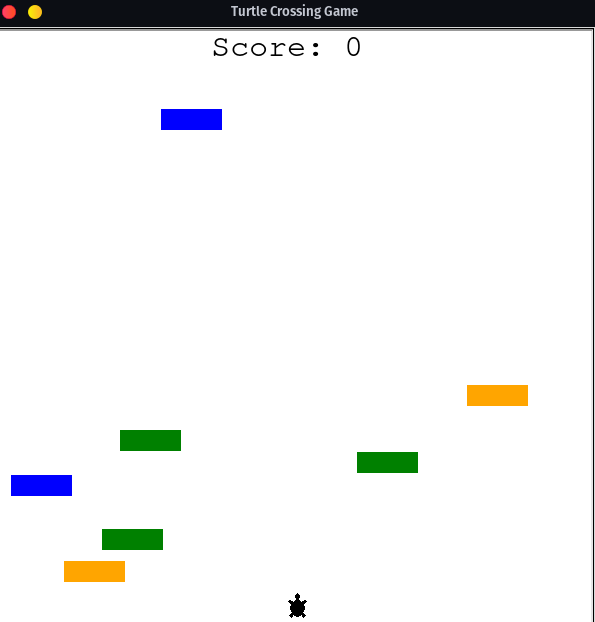

# Turtle Crossing Game

This is a simple yet engaging game created using Python's Turtle graphics module. The objective of the game is to guide
the turtle through the traffic lanes and reach the other side of the screen without colliding with any of the cars. Each
time the turtle successfully crosses the screen, the difficulty increases with faster cars and more traffic.


## Table of Contents

- [Installation](#installation)
- [Usage](#usage)
- [Contributing](#contributing)
- [License](#license)

## Installation

To get started, make sure you have Python 3 installed on your computer. You can download the latest version of Python
from the official website:

[Python Download](https://www.python.org/downloads/)

Next, clone the repository or download the source code to your local machine. Navigate to the project folder in your
terminal and run the following command to install the required dependencies:

```
pip install -r requirements.txt
```

## Usage

After installing the required dependencies, navigate to the project folder in your terminal and run the following
command to start the game:

```
python main.py
```

Once the game window opens, you can use the `Up` arrow key on your keyboard to move the turtle up. Press the `Space` key
to stop the turtle from moving.

## Contributing

Contributions are welcome! If you have any suggestions, bug reports, or feature requests, please feel free to open an
issue or submit a pull request.

## License

This project is licensed under the MIT License. See the [LICENSE](LICENSE) file for more details.